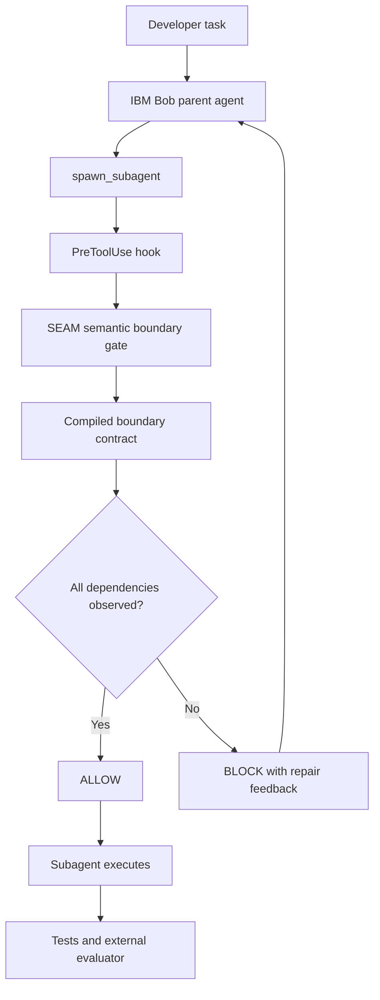

# Architecture

## Runtime path



The hook consumes the existing Bob protocol:

```json
{
  "hook_event_name": "PreToolUse",
  "tool_name": "spawn_subagent",
  "tool_input": {
    "description": "...",
    "fork_context": true
  }
}
```

SEAM extracts `tool_input.description`. It triggers only for
`spawn_subagent`; other tools are logged and allowed. An unrelated delegation
is allowed when the customer-field contract does not apply.

## Contract isolation

The compiled contract is stored in `runtime-contracts/`, outside
`demo-workspace/`. Bob's ordinary repository tools can inspect the demo source,
policies, and tests, but cannot discover the compiled contract through normal
workspace browsing. The hook receives the path via:

```bash
SEMANTIC_BOUNDARY_CONTRACT_PATH=/absolute/path/to/runtime-contracts/customer-field-migration.json
```

If the variable is absent, the hook searches upward for the release-level
`runtime-contracts` directory. If the contract cannot be loaded, the hook
fails closed with exit code `2` and a clear error.

Events remain visible in the workspace at
`demo-workspace/.semantic-boundary/events.ndjson`. They contain timestamps,
decision metadata, dependency IDs, evidence references, and a SHA-256 hash of
the description; they do not contain the prompt text or secrets.

## Deterministic classification

The contract defines marker groups for C, R, and L. A dependency is observed
only when every group for that dependency matches. This is a deterministic
semantic check, not an LLM quality score.

The current contract is intentionally narrow:

| Dependency | Boundary meaning |
|---|---|
| C | Previous mobile clients may still send `customerName`; N+1 accepts it. |
| R | N and N+1 coexist; preserve `customer_name`, add/backfill `full_name`, remove later. |
| L | Version N may still write only `customer_name`; N+1 reads those live rows. |

If a customer migration handoff contains C and R but not L, SEAM blocks it. If
all three are present, it allows the delegation.

## Design boundary

SEAM is a compiled-contract runtime gate, not a claim of universal automatic
dependency discovery. The research workflow identifies a dependency worth
protecting; the runtime enforces its presence at the delegation boundary.

