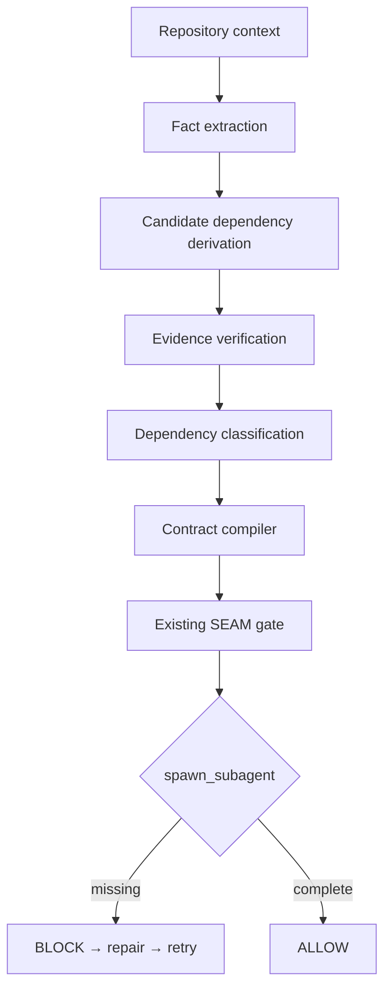

# SEAM Discover

SEAM adds an evidence-backed discovery stage before its existing runtime gate:



The current deterministic provider reads the customer migration's
`docs/client-support.md`, `infra/rollout-policy.md`, `src/customer-service.ts`,
`migrations/002-customer-full-name.ts`, and the preserved
`evaluator/frozen-vN/legacy-customer-service.ts` when available. It extracts
named facts with source paths and snippets, then derives candidates only when
the required fact combination exists.

## L derivation

`LIVE_N_WRITE_COMPAT` comes from a composable chain:

1. The rollout policy says N and N+1 can serve traffic at the same time.
2. The frozen version-N service inserts rows with only `customer_name`.
3. The migration adds `full_name`.
4. The read path falls back to `customer_name` when `full_name` is unavailable.

Therefore an N write can create a legacy-only row after migration, and N+1
needs to keep reading it. Each fact retains its repository path and matching
source excerpt in `candidate-dependencies.json`; the candidate records the
fact IDs and derivation in `provenance`.

## Verification and compilation

`verify` reads the curated `evidence/boundary-summary.json`. It requires three
runs per condition, `valid_runs: 6/6`, and exact recorded scores before
classifying L as `PROVEN`: L0 is 4/5 × 3 and L1 is 5/5 × 3. The claim is scoped
to relevance in this controlled workflow. C and R are `SUPPORTED` from source
constraints and remain without isolated counterfactual evidence.

`compile` writes
`runtime-contracts/generated/customer-field-migration.json`. It preserves the
existing gate contract's applicability and marker groups exactly; discovery
classification is reported separately and does not change gate behavior.
This makes the generated contract directly consumable by the existing hook
while avoiding a speculative runtime policy change.

```bash
npm run seam:discover
```

Individual stages:

```bash
python3 scripts/seam.py discover --workspace demo-workspace --workflow customer-field-migration
python3 scripts/seam.py verify --candidates .semantic-boundary/discovery/candidate-dependencies.json --evidence evidence/boundary-summary.json
python3 scripts/seam.py compile --verified .semantic-boundary/discovery/verified-dependencies.json --output runtime-contracts/generated/customer-field-migration.json
python3 scripts/seam.py inspect
```

## Provider boundary and limitations

Discovery depends on the `DiscoveryProvider` interface. The implemented
`DeterministicRepositoryProvider` emits facts from repository text; verification
and compilation consume provider-independent candidate JSON. A future
candidate-generation provider can supply the same structure without changing
those later stages.

SEAM Discover currently uses deterministic extraction rules for the
demonstrated migration workflow. The architecture allows future
candidate-generation providers, including IBM Bob, without changing the
evidence verification or enforcement layers.

This is not universal automatic semantic discovery. Rules cover one workflow,
source patterns can be missed when repositories express constraints
differently, and evidence verification only classifies a dependency as
`PROVEN` when an isolated valid counterfactual is available. The current
synthetic API fixture exercises shared derivation primitives in a unit test;
it is not a second end-to-end workflow or proof claim. No IBM Bob invocation
is part of discovery or the demo command.
